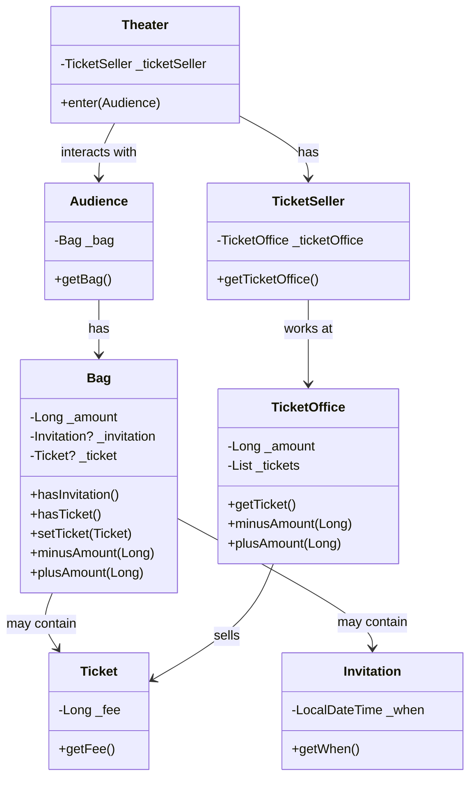

# 티켓 판매 애플리케이션
## 요구 사항
1. 이벤트 당첨 관람객, 그렇지 못한 관람객을 나눈다.
2. 이벤트 당첨 관람객은 초대장을 티켓으로 입장하고, 그렇지 못한 관람객은 티켓 구매로 입장할 수 있다.
   * 공연을 관람하는 관객들은 티켓을 소지하고 있다.
   * 이벤트 당첨 관람객은 초대장을 가지고 있고, 그렇지 못한 관람객은 구매할 수 있는 현금을 가지고 있다.
   * 즉, 관람객은 초대장, 현금, 티켓 3개를 소지한다.
3. 가방에는 이 소지품들을 담을 수 있다.
   * 가방은 관람객의 이벤트 당첨 유무에 따라 소지품의 변동이 생긴다.
   * 이벤트가 당첨되어 있다면 가방엔 초대장이 있을 것이고, 그렇지 못한 관람객은 초대장이 없고 현금만 있을 것이다.
4. 관람객은 소지품 보관을 위해 가방을 소지할 수 있다.
5. 매표소는 관람객에게 판매할 티켓과, 티켓의 판매 금액이 있어야 한다.
6. 판매원은 티켓을 교환해주거나 티켓을 판매하는 역할을 수행하기 때문에 어느 매표소에 위치할지 알아야한다.
7. 소극장은 관람객을 수용하는 장소이다.

---
## 컴포넌트 다이어그램


---
## 1차 코드의 문제점
Theater의 enter 메서드는 객체의 자율성이 보장되지 않고, 소극장에 의해 관람객과 판매원을 통제한다.

```kotlin
class Theater(private var _ticketSeller: TicketSeller) {
    fun enter(audience: Audience) {
        // 초대장이 있는 경우
        if (audience.bag.hasInvitation()) {
            val ticket = this._ticketSeller.ticketOffice.getTicket()
            audience.bag.setTicket(ticket)
        } else {
            val ticket = this._ticketSeller.ticketOffice.getTicket()
            audience.bag.minusAmount(ticket.fee)
            this._ticketSeller.ticketOffice.plusAmount(ticket.fee)
            audience.bag.setTicket(ticket)
        }
    }
}
```

코드를 해석하면 소극장은 다음과 같은 작업을 수행한다.
* 소극장이 관람객의 가방을 열어 초대장을 확인하고 티켓을 가방에 넣는다.
* 판매원으로 하여금 매표소의 티켓을 꺼내고 현금에 접근한다.

코드는 그럴 수 있겠으나 실세계에서 이해 가능한 범주를 넘어서게 된다.  
또한 하나의 메서드(책임)에서 많은 양의 정보를 기억하고 작업을 수행한다.

즉, 상식과 다른 로직과 많은 양의 정보는 코드를 읽는 사람에게 제대로 된 의사소통을 제공하지 못하게 된다.

그리고 Theater는 다양한 객체를 참조하고 있기 때문에 변경에 취약하다라는 문제점에 노출된다.

---
